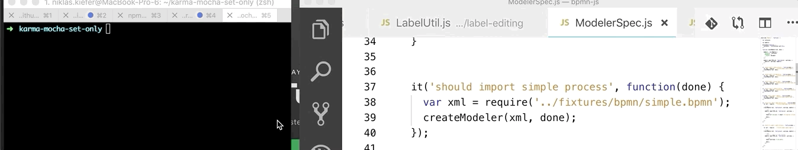

# mocha-set-only

Sets the [`only`](https://stackoverflow.com/questions/10832031/how-to-run-a-single-test-with-mocha) tag to a mocha-test for a given file

```sh
$ npm i mocha-set-only
$ mocha-set-only -—f="/Users/niklas.kiefer/Github/bpmn-js/test/spec/ModelerSpec.js" -—test="should import simple process"
```

